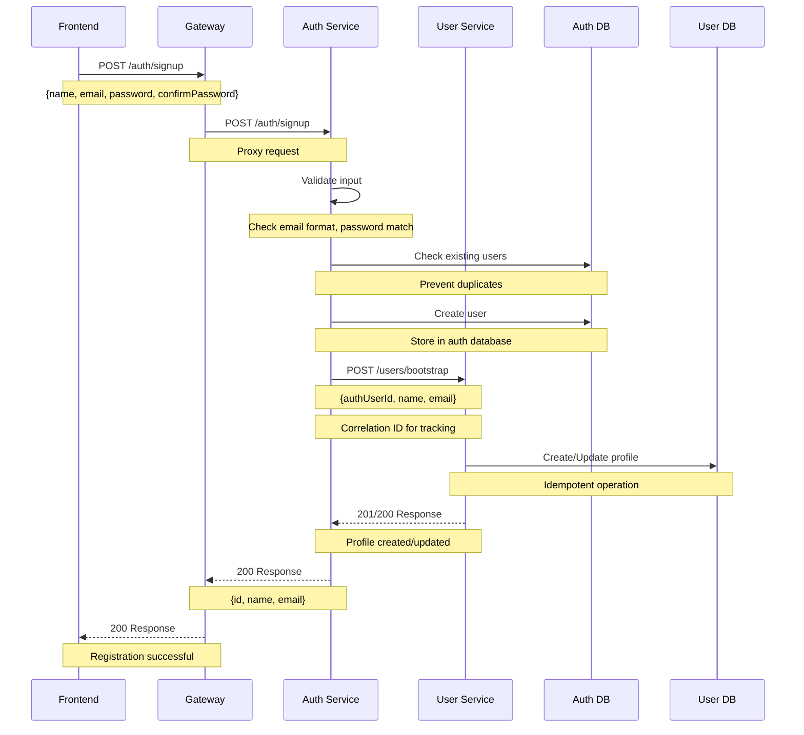
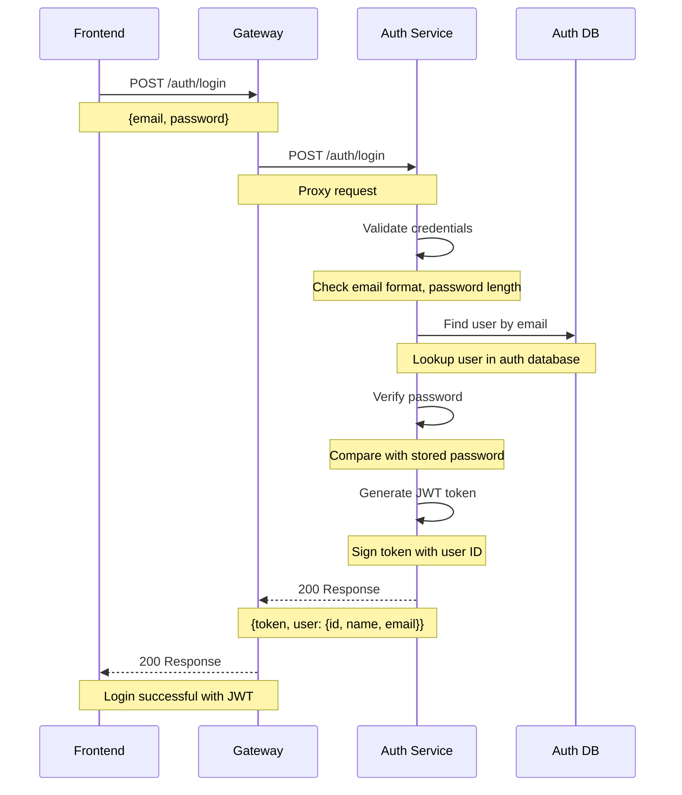
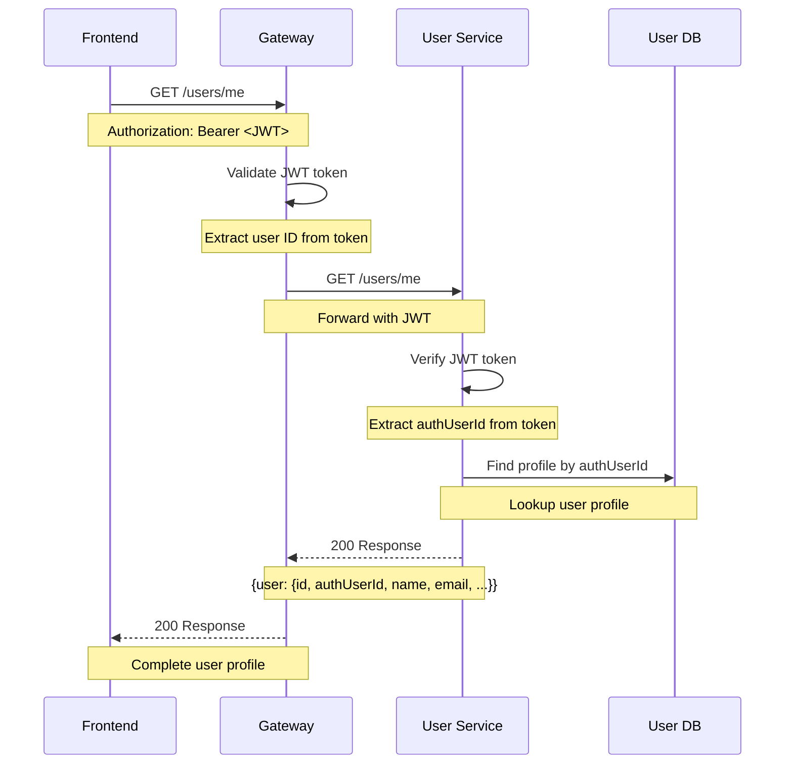

# Backend Microservices Architecture

This backend is built using a **microservices architecture** with Fastify and SQLite. The system is divided into three main services: **Auth Service**, **User Service**, and **API Gateway**.

## 🧩 Microservices Overview

The system is structured using a **microservices architecture**, designed to keep concerns separated and services independently deployable. Here's how it works from the perspective of a request initiated by the frontend:

- **Frontend (Port 3000)**
  A single-page application (SPA) that initiates all requests to the backend.
  It never talks directly to individual services like Auth or User — instead, it goes through the API Gateway.

- **API Gateway (Port 3003)**
  Acts as the **single entry point** for all backend services.
  - Routes requests to the correct internal microservice
    - `/auth/*` → Auth Service
    - `/users/*` → User Service
  - Validates JWT tokens for protected routes
  - Adds logging, correlation IDs, and error boundaries
  - Makes the frontend simpler and more secure

- **Auth Service (Port 3001)**
  Handles **user registration, login, and authentication**.
  - Stores secure credentials (email, hashed password)
  - Issues and validates JWT tokens
  - Does not manage user profiles or game data

- **User Service (Port 3002)**
  Manages **user profile data and game-related information**.
  - Stores public info like name, avatar, and bio
  - Maintains friend relationships, match history, and statistics
  - Each record is linked to the Auth Service via `authUserId`
  - Supports a `/users/bootstrap` route for creating a new profile after registration

- ** Websocket connection (Port : 4000) **
  Manae websocket connection so every user logged can connect to the others.
  - Create a connection when the user loggin in the website getting the ID of each user.
  - Connects directly with the front end, throught the port 4000.
  - Works independently of the gateway as is not a direct http request.

This design allows services to evolve independently. For example, if we later add a `matchmaking` or `notification` service, the frontend doesn't need to change — it will still just talk to the Gateway.

Each service uses its own **SQLite database** and is fully decoupled from others except for intentional HTTP-based communication. This separation makes the system more robust, maintainable, and easier to scale.

## 🚀 Initial Setup for New Team Members

### Prerequisites & Cleanup

**⚠️ IMPORTANT: Clean up any existing monolithic backend installation first!**

If you previously worked with the monolithic backend, you need to clean up before setting up microservices:

```bash
# Navigate to project root
cd /path/to/ft_transcendence

# Remove old monolithic backend files (if they exist)
rm -rf backend/src/
rm -rf backend/prisma/
rm -f backend/server.js
rm -f backend/package.json
rm -f backend/package-lock.json

# Remove old database files
rm -f backend/*.db
rm -f backend/auth-service/*.db
rm -f backend/user-service/*.db
rm -f backend/gateway/*.db
```

### Pre-commit Hooks Setup

This project uses **pre-commit hooks** to ensure code quality. The hooks automatically run ESLint on backend files before each commit.

**Prerequisites:**
- A `backend/package.json` file with linting scripts must exist
- ESLint dependencies must be installed in the backend directory

**Setup commands:**

```bash
# 1. Install Husky (Git hooks manager) in project root
npm install --save-dev husky

# 2. Install ESLint dependencies in backend directory
cd backend
npm install
cd ..

# 3. Initialize Husky
npx husky init

# 4. Create the pre-commit hook
echo '#!/bin/sh
if git diff --cached --name-only | grep -q "^backend/"; then
  echo "🔍 Backend files changed, running linter..."
  cd backend && npm run lint:fix
  if [ $? -ne 0 ]; then
    echo "❌ Linting failed. Please fix the issues before committing."
    exit 1
  fi
  echo "✅ Backend linting passed!"
fi' > .husky/pre-commit

# 5. Make the hook executable
chmod +x .husky/pre-commit

# 6. Add prepare script to root package.json
npm pkg set scripts.prepare="husky"
```

**What the pre-commit hook does:**
- ✅ Only runs when files in `backend/` are staged for commit
- ✅ Automatically runs `npm run lint:fix` to fix auto-fixable issues
- ✅ Prevents commit if linting fails
- ✅ Can be bypassed with `git commit --no-verify` if needed

**Backend package.json structure:**
The `backend/package.json` contains linting scripts that run ESLint across all microservices:
- `npm run lint` - Check for linting errors
- `npm run lint:fix` - Fix auto-fixable linting errors

### Code Style Guidelines

**Unused Variables Convention:**
- Prefix unused parameters with `_` (e.g., `_request`, `_reply`, `_opts`)
- This tells ESLint to ignore them and makes code intent clear
- Examples:
  ```javascript
  // ✅ Good - unused parameter prefixed with _
  fastify.get('/health', async (_request, _reply) => {
    return { status: 'ok' };
  });

  // ❌ Bad - will trigger linting warning
  fastify.get('/health', async (request, reply) => {
    return { status: 'ok' };
  });
  ```

## 🏗️ Architecture Overview

```
┌─────────────────┐    ┌─────────────────┐    ┌─────────────────┐
│   Frontend      │    │   API Gateway   │    │   Auth Service  │
│   (Port 3000)   │◄──►│   (Port 3003)   │◄──►│   (Port 3001)   │
└─────────────────┘    └─────────────────┘    └─────────────────┘
        │                       │
        │                       │
        ▼                       │
┌─────────────────┐             │
│    Websocket    │             │
│   (Port 4000)   │             │
└─────────────────┘             ▼
                       ┌─────────────────┐
                       │  User Service   │
                       │   (Port 3002)   │
                       └─────────────────┘
```

## 🚀 Quick Start

### Prerequisites
- Node.js (v18 or higher)
- npm

### First Installation

**Auth Service Setup:**
```bash
cd backend/auth-service
npm install
npm run seed
```

**User Service Setup:**
```bash
cd backend/user-service
npm install
npm run seed
```

**Gateway Setup:**
```bash
cd backend/gateway
npm install
```

**Websocket Setup:**
```bash
cd ws-service
npm install
```

**Frontend Setup:**
```bash
cd frontend
npm install
```

### Running the Services

If already installed, start each service in separate terminals:

**Terminal 1 - Auth Service (Port 3001):**
```bash
cd backend/auth-service
npm install  # Just in case something new happened
npm run dev
```

**Terminal 2 - User Service (Port 3002):**
```bash
cd backend/user-service
npm install  # Just in case something new happened
npm run dev
```

**Terminal 3 - Gateway (Port 3003):**
```bash
cd backend/gateway
npm install  # Just in case something new happened
npm run dev
```

**Terminal 4 - Frontend (Port 3000):**
```bash
cd frontend
npm install  # Just in case something new happened
npm run dev
```

**Terminal 5 - Frontend (Port 3000):**
```bash
cd ws-service
npm install  # Just in case something new happened
npm run dev
```

### Verify Services
```bash
# Check if all services are running
curl http://localhost:3001/health  # Auth Service
curl http://localhost:3002/health  # User Service
curl http://localhost:3003/health  # Gateway
curl http://localhost:3000         # Frontend
```

## 📋 Services

### 🔐 Auth Service (Port 3001)
- **Purpose**: User authentication, registration, JWT token management
- **Database**: `auth.db` (SQLite)
- **Endpoints**: `/auth/login`, `/auth/signup`
- **Dependencies**: Fastify, JWT, Axios

### 👤 User Service (Port 3002)
- **Purpose**: User profiles, friends, game statistics
- **Database**: `user.db` (SQLite)
- **Endpoints**: `/users`, `/users/me`, `/users/bootstrap`
- **Dependencies**: Fastify, JWT

### 🌐 API Gateway (Port 3003)
- **Purpose**: Single entry point, request routing, authentication
- **Features**: JWT validation, request proxying, logging
- **Routes**: `/auth/*` → Auth Service, `/users/*` → User Service

---

## 🔄 Authentication Flows

### 1. User Registration (Signup) Flow



**Key Features:**
- ✅ **Idempotent**: Multiple calls won't create duplicates
- ✅ **Error Handling**: Auth user created even if profile fails
- ✅ **Correlation Tracking**: Full request tracing
- ✅ **Validation**: Input sanitization and format checking

### 2. User Login Flow



**Key Features:**
- ✅ **Security**: Generic error messages prevent user enumeration
- ✅ **JWT Tokens**: Stateless authentication
- ✅ **Validation**: Input sanitization
- ✅ **Error Handling**: Graceful failure responses

### 3. User Profile Access Flow



---

## 🗄️ Database Schema

### Auth Service Database (`auth.db`)
```sql
CREATE TABLE User (
  id INTEGER PRIMARY KEY AUTOINCREMENT,
  email TEXT UNIQUE NOT NULL,
  name TEXT UNIQUE NOT NULL,
  password TEXT NOT NULL,
  createdAt TEXT DEFAULT (datetime('now')),
  updatedAt TEXT DEFAULT (datetime('now'))
);
```

### User Service Database (`user.db`)
```sql
CREATE TABLE UserProfile (
  id INTEGER PRIMARY KEY AUTOINCREMENT,
  authUserId INTEGER UNIQUE NOT NULL,  -- References auth-service user ID
  name TEXT UNIQUE NOT NULL,            -- Duplicated for performance
  email TEXT NOT NULL,                  -- Duplicated for performance
  profilePicture TEXT DEFAULT '/assets/default-avatar.jpeg',
  bio TEXT DEFAULT 'Hi, I''m playing Arcade Clash',
  createdAt TEXT DEFAULT (datetime('now')),
  updatedAt TEXT DEFAULT (datetime('now'))
);

-- Join table for many-to-many friends relationship
CREATE TABLE _UserFriends (
  userProfileId INTEGER NOT NULL,
  friendId INTEGER NOT NULL,
  PRIMARY KEY (userProfileId, friendId),
  FOREIGN KEY (userProfileId) REFERENCES UserProfile(id) ON DELETE CASCADE,
  FOREIGN KEY (friendId) REFERENCES UserProfile(id) ON DELETE CASCADE
);

-- Match table
CREATE TABLE Match (
  id INTEGER PRIMARY KEY AUTOINCREMENT,
  type TEXT NOT NULL,
  date TEXT DEFAULT (datetime('now')),
  player1Id INTEGER,
  player2Id INTEGER,
  winnerId INTEGER,
  player1Score INTEGER NOT NULL,
  player2Score INTEGER NOT NULL,
  FOREIGN KEY (player1Id) REFERENCES UserProfile(id),
  FOREIGN KEY (player2Id) REFERENCES UserProfile(id),
  FOREIGN KEY (winnerId) REFERENCES UserProfile(id)
);
```

---

## 🔧 Environment Variables

Create a `.env` file in the root directory:

```env
# Service Ports
AUTH_SERVICE_PORT=3001
USER_SERVICE_PORT=3002
GATEWAY_PORT=3003
FRONTEND_PORT=3000

# Database URLs
AUTH_DATABASE_URL="file:./data/auth.db"
USER_DATABASE_URL="file:./data/user.db"

# Service URLs (for inter-service communication)
USER_SERVICE_URL="http://localhost:3002"

# Host Configuration
HOST="0.0.0.0"
NODE_ENV="development"
```

---

## 🧪 Testing the Flows

### Test Registration Flow
```bash
# 1. Start all services
Start all services in separate terminals

# 2. Test signup
curl -X POST http://localhost:3003/auth/signup \
  -H "Content-Type: application/json" \
  -d '{
    "name": "testuser",
    "email": "test@example.com",
    "password": "password123",
    "confirmPassword": "password123"
  }'

# Expected: 200 with {id, name, email}
```

### Test Login Flow
```bash
# 1. Test login
curl -X POST http://localhost:3003/auth/login \
  -H "Content-Type: application/json" \
  -d '{
    "email": "test@example.com",
    "password": "password123"
  }'

# Expected: 200 with {token, user: {id, name, email}}
```

### Test Profile Access
```bash
# 1. Get user profile (replace TOKEN with actual JWT)
curl -X GET http://localhost:3003/users/me \
  -H "Authorization: Bearer YOUR_JWT_TOKEN"

# Expected: 200 with complete user profile
```

---

## 📊 Monitoring & Logging

### Correlation IDs
All requests include correlation IDs for tracking across services:
- Format: `auth-{userId}-{timestamp}` or `user-{userId}-{timestamp}`
- Headers: `X-Correlation-ID`
- Logs: Full request tracing across all services

### Health Checks
```bash
# Check service health
curl http://localhost:3001/health  # Auth Service
curl http://localhost:3002/health  # User Service
curl http://localhost:3003/health  # Gateway
```

---

## 🚨 Error Handling

### Registration Errors
- **400**: Validation errors (missing fields, invalid email, password mismatch)
- **400**: Duplicate user (name or email already exists)
- **500**: Internal server error

### Login Errors
- **400**: Missing credentials
- **401**: Invalid credentials (generic message for security)
- **500**: Internal server error

### Profile Errors
- **401**: Unauthorized (invalid/missing JWT)
- **404**: User profile not found
- **500**: Internal server error

---

## 🔄 Inter-Service Communication

### Auth Service → User Service
- **Endpoint**: `POST /users/bootstrap`
- **Purpose**: Create/update user profile after registration
- **Timeout**: 5 seconds
- **Retry**: None (logs failure, continues with auth success)
- **Idempotent**: Yes (creates or updates based on `authUserId`)

### Gateway → Services
- **Auth Service**: All `/auth/*` routes
- **User Service**: All `/users/*` routes
- **Authentication**: JWT validation for protected routes
- **Logging**: Request/response logging with correlation IDs

---

## 🛠️ Development Commands

### Starting Services
```bash
# Start individual services in separate terminals
cd backend/auth-service && npm run dev    # Port 3001
cd backend/user-service && npm run dev    # Port 3002
cd backend/gateway && npm run dev         # Port 3003
cd frontend && npm run dev                # Port 3000
```

### Database Management
```bash
# Auth Service Database
cd backend/auth-service
npm run seed              # Create/seed database (idempotent)

# User Service Database
cd backend/user-service
npm run seed              # Create/seed database (idempotent)

# View databases (using SQLite CLI)
sqlite3 backend/auth-service/data/auth.db
sqlite3 backend/user-service/data/user.db
```

### Testing & Debugging
```bash
# Test individual services
curl http://localhost:3001/health  # Auth Service
curl http://localhost:3002/health  # User Service
curl http://localhost:3003/health  # Gateway

# View service logs (each terminal shows its own logs)
# Auth Service logs: User registration, login attempts, JWT generation
# User Service logs: Profile creation, bootstrap operations
# Gateway logs: Request routing, JWT validation, proxy operations
```

### Cleanup
```bash
# Stop services: Ctrl+C in each terminal

# Clean node_modules (if needed)
rm -rf backend/auth-service/node_modules
rm -rf backend/user-service/node_modules
rm -rf backend/gateway/node_modules
rm -rf frontend/node_modules

# Drop databases (if needed)
rm -f backend/auth-service/data/auth.db
rm -f backend/user-service/data/user.db

# Reinstall dependencies
cd backend/auth-service && npm install
cd backend/user-service && npm install
cd backend/gateway && npm install
cd frontend && npm install

# Recreate databases after cleanup
cd backend/auth-service
npm run seed

cd backend/user-service
npm run seed
```


## 🤝 Contributing

1. Follow the existing code style and patterns
2. Add comprehensive logging with correlation IDs
3. Include proper error handling
4. Update documentation for any new features
5. Test all flows before submitting changes

---

## 📄 License

This project is part of the ft_transcendence study project at School 42.
